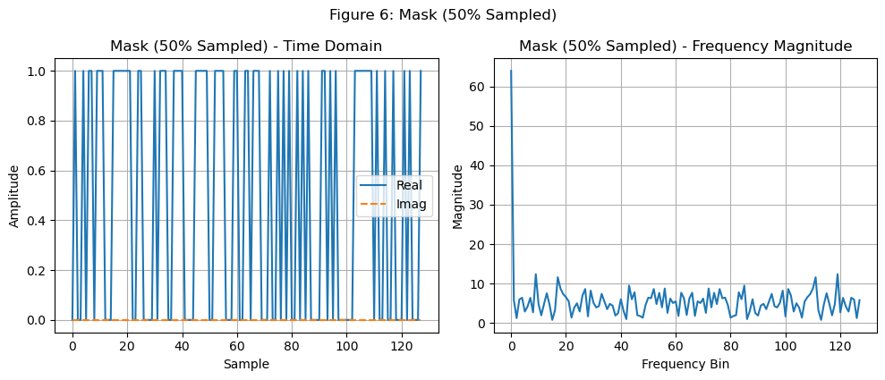

## Intuitive Understanding of Compressed Sensing

Compressed sensing (also known as compressive sampling or sparse sampling) is a technique for finding sparse solutions to underdetermined linear systems. It's widely applied in electrical engineering and signal processing to acquire and reconstruct sparse or compressible signals. Leveraging the sparsity property of a signal, compressed sensing enables signal recovery from significantly fewer measurements than what the Nyquist-Shannon sampling theorem traditionally requires.

This blog offers a simple and intuitive understanding of compressed sensing, avoiding heavy mathematical formulations.

### The Key Idea

In compressed sensing, we consider signals that are sparse in one domain and perform undersampling in another, less sparse domain. Once the undersampled measurements are transformed to the sparse domain, the resulting aliasing can often be treated as incoherent noise. This incoherence is what enables us to recover the original signal using algorithms like soft-thresholding or POCS.

### Background: The Nyquist Sampling Theorem

The Nyquist-Shannon sampling theorem is fundamental in signal processing. It states that a signal can be perfectly reconstructed from its samples if the sampling rate is at least twice the signal's highest frequency.

For instance, consider two signals:

\[f_1(t) = \cos(\pi t) + \cos(2\pi t)\]
\[f_2(t) = 2\cos(\pi t)\]

If we sample both at 1 Hz, the samples become indistinguishable, demonstrating the phenomenon of aliasing — a case of coherent overlap that leads to information loss. This illustrates why sampling must meet or exceed the Nyquist rate to avoid ambiguity.

Even when sampling above the Nyquist rate, spectral leakage can occur, warranting practical oversampling at 3-5x the signal bandwidth.

However, compressed sensing operates below the Nyquist limit, seeking to reconstruct signals from fewer measurements than traditionally required.

### The Compressed Sensing Approach

Let us consider a signal that is sparse in the frequency domain — say, it contains only 5 non-zero Fourier components among 128 total frequencies. According to Nyquist, we'd need 128 time-domain samples to fully reconstruct the signal.

But compressed sensing tells us otherwise.

We can randomly select only 50% or even 25% of the time-domain samples. The resulting frequency spectrum from these partial measurements appears noisy — the missing data causes incoherent aliasing that spreads energy across many frequencies.

This is the key: **incoherent aliasing from undersampling looks like noise in the sparse domain**, which we can suppress using denoising techniques.

#### Soft-thresholding

One popular method for sparse recovery is soft-thresholding:

\[x_{soft} = \text{sign}(x) \cdot \max(|x| - \lambda, 0)\]

Where \( \lambda \) is a threshold parameter that shrinks small coefficients toward zero while preserving significant ones. This process promotes sparsity in the solution.

#### 25% Sampling Example

Even with only 25% of the time-domain samples, soft-thresholding can still recover the major components of the signal:

### What About the Sampling Mask?

The mask used for time-domain sampling (a binary sequence with 1s at sampled locations and 0s elsewhere) has its own Fourier transform. When the signal is multiplied by the mask in time, the effect in frequency is a convolution with the mask’s spectrum.

In the ideal case (full sampling), the mask’s spectrum is a Dirac delta (or sinc function in practice). But for random masks, the spectrum spreads energy more uniformly.

We can still apply soft-thresholding in these cases:

### Summary

Compressed sensing allows us to break the Nyquist limit when signals are sparse in a certain domain. By undersampling in a less sparse domain and transforming to the sparse domain, the resulting aliasing acts like noise, which can be suppressed to recover the original signal.

Algorithms like soft-thresholding and POCS make this recovery practical and surprisingly accurate.

### Further Applications

Compressed sensing has applications in MRI reconstruction, audio compression, single-pixel cameras, and more.

### Code & Resources

The full implementation code is available at [compressedSensingBlog](https://github.com/Hubuguilai/compressedSensingBlog). If you find it helpful, feel free to star the repo!

### References

1. Donoho D L. Compressed sensing. IEEE Transactions on Information Theory, 2006, 52(4): 1289–1306.  
2. 压缩感知理论与应用, 机械工业出版社, 2019.  
3. [Stanford EE369C Course](https://web.stanford.edu/class/ee369c/)  
4. [知乎文章：形象易懂讲解压缩感知](https://zhuanlan.zhihu.com/p/22445302)

